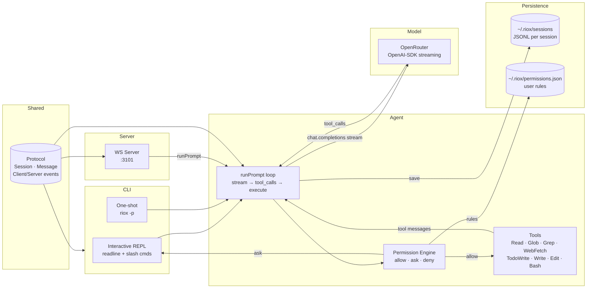

```
██████╗ ██╗ ██████╗ ██╗  ██╗
██╔══██╗██║██╔═══██╗╚██╗██╔╝
██████╔╝██║██║   ██║ ╚███╔╝
██╔══██╗██║██║   ██║ ██╔██╗
██║  ██║██║╚██████╔╝██╔╝ ██╗
╚═╝  ╚═╝╚═╝ ╚═════╝ ╚═╝  ╚═╝
```

A terminal coding agent built with Bun, TypeScript, and OpenRouter. Uses a streaming tool-call loop for autonomous code changes, a permission engine for safe execution, JSONL sessions for persistence, and includes a WebSocket server plus shared protocol for remote clients.

> [!NOTE]
> Work in progress. The CLI, agent loop, permissions, sessions, and server are working. Docs site, UI package, and tests are still starter-template stubs.

---

## Architecture



---

## Features

### Core Agent Loop
- **Streaming Tool-Call Loop** — `runPrompt()` streams chat completions from OpenRouter, accumulates `tool_calls`, executes them via the tool registry, and feeds `tool` messages back until the model answers directly (default `maxTurns: 10`, `MAX_TOKENS: 2048`).
- **REPL + One-Shot** — Interactive `readline` REPL with slash commands and per-turn session save, or `riox -p "prompt"` for single-shot stdout/JSON execution.
- **Sessions** — Every run persists to `~/.riox/sessions/<id>.jsonl`. Resume with `--continue` / `--resume [id]`, list/fork/delete via the session store.
- **Model Flexibility** — Any OpenRouter model id via `--model` or `RIOX_MODEL` (default `nvidia/nemotron-3-ultra-550b-a55b:free`).

### Permissions
- **Three Decisions** — Every tool call evaluates to `allow`, `ask` (interactive `y/n/always/never`), or `deny`. Read-only tools (`Read`, `Glob`, `Grep`, `WebFetch`, `TodoWrite`) auto-allow; `Write`, `Edit`, and mutating `Bash` ask by default.
- **Deny-by-Default Destructive Shell** — `rm*`, `mv*`, `chmod*`, `chown*`, `sudo*`, and pipe-to-shell (`curl|sh`) are denied even in ask mode.
- **Four Modes** — `default`, `acceptEdits` (auto-allow Write/Edit), `plan` (deny Write/Edit/Bash — research only), `bypass` (allow all, same as `--dangerously-skip-permissions`).
- **Persistent Rules** — `always`/`never` answers are stored in `~/.riox/permissions.json`. CLI flags `--allow-tool tool[@pattern]` / `--deny-tool tool[@pattern]` add per-run rules.
- **Cwd-Jailed Tools** — File tools resolve inside the working directory; outputs are capped (30k) so runaway commands can't flood the context.

### Tools
| Tool | Inputs | Description |
|---|---|---|
| `Read` | `path, offset?, limit?` | Read a file or directory listing |
| `Glob` | `pattern` | Fast file pattern matching (`**/*.ts`) |
| `Grep` | `pattern, include?, path?` | Regex content search, skips `node_modules/.git/dist` |
| `WebFetch` | `url` | Fetch a URL, HTML stripped to text (20s timeout) |
| `TodoWrite` | `todos[{content, status, priority?}]` | Structured task list (max 20, in-memory per run) |
| `Write` | `path, content` | Create/overwrite a file (asks approval) |
| `Edit` | `path, oldString, newString, replaceAll?` | Exact-match replacement, rejects ambiguous matches |
| `Bash` | `command, timeoutMs?` | Shell exec (`sh -c`/`cmd /c`, default 120s, capped output) |

### Server + Protocol
- **WS Server `:3101`** — Thin Bun wrapper over the same `runPrompt()`. `GET /health` plus `GET /v1/stream` WebSocket upgrade; `session.new` → `session.created`, `chat.send` streams `tool.start / tool.result`, `chat.delta`, `chat.done`.
- **Shared Protocol** — `Session`, `ChatMessage`, `TokenUsage`, `PermissionDecision`, `PermissionMode`, `PermissionRule` types plus `ClientEvent`/`ServerEvent` framing with `parse`/`serialize` helpers, consumed by CLI, server, and agent.

### CLI
| Invocation | Description |
|---|---|
| `riox` | Interactive REPL (requires TTY) |
| `riox --continue` | REPL resumed from the latest session |
| `riox --resume [id]` | REPL resumed from session `id` (or latest if omitted) |
| `riox -p, --print <prompt>` | One-shot run, streams text to stdout |
| `riox --health` | Check the local server's `/health` |
| `riox --version, -v` | Print version + engine |
| `riox --help, -h` | Print help |

---

## Getting Started

### Prerequisites
- Node.js 24+
- Bun 1.3+
- An OpenRouter API key

### Setup

```bash
# Install dependencies
bun install

# Configure environment
cp .env.example .env
# Edit .env with your OpenRouter key
```

Required root `.env` variables:
```
OPENROUTER_API_KEY=
RIOX_MODEL=
```

`RIOX_MODEL` is optional — any OpenRouter model id, defaults to `nvidia/nemotron-3-ultra-550b-a55b:free`. Flag `--model` overrides both.

### Start the REPL

```bash
bun --filter cli dev
# or
riox
```

Opens the interactive agent at your shell. Slash commands: `/help /clear /compact /model /max-turns /skip-perms /status /exit`.

### One-Shot Prompting

```bash
riox -p "explain what this repo does"
riox -p "find the auth middleware" --output-format json --max-turns 5
```

Streams text to stdout, or emits `{content, model, usage, tools}` with `--output-format json`.

### Start the Server

```bash
bun --filter server dev
```

Serves `http://localhost:3101` (`/health`, `/v1/stream` WebSocket). No auth — local use only.

### Start the Docs Site

```bash
bun --filter docs dev
```

Opens the Next.js docs starter at `http://localhost:3001`. (Template stub — real docs pending.)

---

## Project Structure

```
riox/
├── apps/
│   ├── cli/                    # `riox` binary (REPL + one-shot + flags)
│   │   └── src/
│   │       ├── index.ts        # Arg parsing, --print/--resume/--health dispatch
│   │       └── permissions.ts  # y/n/always/never approval prompt
│   ├── server/                 # Bun WS server :3101 over runPrompt()
│   │   └── src/index.ts        # /health, /v1/stream upgrade, chat.send handler
│   └── docs/                   # Next.js docs starter (stub)
│       └── app/page.tsx        # Default create-next-app page
├── packages/
│   ├── agent/                  # Agentic loop + tools + sessions + permissions
│   │   └── src/
│   │       ├── index.ts        # runPrompt(), OpenRouter client, model resolve
│   │       ├── repl.ts         # Interactive REPL + slash commands
│   │       ├── session.ts      # ~/.riox/sessions/*.jsonl store
│   │       ├── permissions.ts  # PermissionEngine + default rules + modes
│   │       └── tools/
│   │           ├── registry.ts # TOOLS, TOOL_MAP, OpenAI function schemas
│   │           ├── types.ts    # ToolDef, ToolContext (cwd-jail)
│   │           ├── files.ts    # Read, Glob, Grep
│   │           ├── web.ts      # WebFetch
│   │           ├── todos.ts    # TodoWrite
│   │           ├── mutate.ts   # Write, Edit
│   │           └── exec.ts     # Bash
│   ├── protocol/               # Shared Session/Message/event types + WS framing
│   │   └── src/
│   │       ├── types.ts        # EngineName, Session, ChatMessage, permissions
│   │       └── events.ts       # ClientEvent, ServerEvent, parse/serialize
│   ├── ui/                     # Shared React stub library (Button, Card, Code)
│   ├── eslint-config/          # Shared eslint configs
│   └── typescript-config/      # Shared tsconfigs
├── .env.example                # OPENROUTER_API_KEY, RIOX_MODEL
└── turbo.json                  # build/dev/lint/check-types pipelines
```

---

## CLI Documentation

### `riox -p, --print <prompt>`

One-shot execution. Streams the answer text to stdout.

```bash
riox -p "list all API routes in apps/server" --model "anthropic/claude-sonnet-4"
```

**Response (`--output-format json`)**
```json
{
  "content": "GET /health, GET /v1/stream ...",
  "model": "anthropic/claude-sonnet-4",
  "usage": { "promptTokens": 1200, "completionTokens": 300, "totalTokens": 1500 },
  "tools": ["Glob", "Grep", "Read"]
}
```

Useful flags: `--max-turns <n>` (default 10), `--permission-mode default|acceptEdits|plan|bypass`, `--allow-tool` / `--deny-tool tool[@pattern]`, `--session-id <id>`.

### `riox --resume [id]`

```bash
riox --resume
riox --resume 7f3a2c1e-85b4-4e3f-a631-f542289c4b7b
```

Reopens the REPL with prior session history loaded. `--continue` is shorthand for the latest session.

### `riox --health`

```bash
riox --health
```

**Response (200 — Server running)**
```json
{
  "ok": true,
  "engine": "openrouter",
  "model": "nvidia/nemotron-3-ultra-550b-a55b:free",
  "version": "0.1.0",
  "sessions": 3,
  "time": "2026-09-19T12:00:00.000Z"
}
```

---

## Protocol Events

Clients send `ClientEvent` JSON over the `/v1/stream` WebSocket; the server streams back `ServerEvent`s.

| Direction | Event | Payload | Description |
|---|---|---|---|
| → | `session.new` | `{title?}` | Create a session, replies `session.created` |
| → | `chat.send` | `{prompt, sessionId?}` | Run the agent loop, streams deltas + tool events |
| ← | `session.created` | `{session}` | New session record |
| ← | `chat.delta` | `{sessionId, messageId, delta}` | Streaming text chunk |
| ← | `chat.done` | `{sessionId, messageId, content}` | Final assembled answer |
| ← | `tool.start` | `{name, summary, permission?}` | A tool call began |
| ← | `tool.result` | `{name, ok, preview, permission?}` | A tool call finished |
| ← | `error` | `{message}` | Malformed event or loop failure |

---

## Agentic Loop

```
prompt → model (stream) → tool_calls?
  ├─ no  → final answer → save session → done
  └─ yes → permission evaluate per call
       ├─ allow → execute tool → feed result back → model
       ├─ ask   → prompt user (y/n/always/never) → allow/deny
       └─ deny  → feed denial back → model
  (repeats until direct answer or maxTurns)
```

- **Text deltas** stream to the caller as they arrive
- **Tool outputs** re-enter context as `tool` messages, so the model can iterate (read → edit → verify)
- **Permissions** persist per session; `always`/`never` answers are remembered in `~/.riox/permissions.json`

---

## License

MIT
